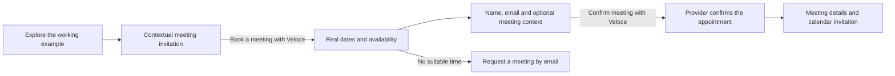

# Turning “The working version” into a meeting journey

Investigated: 2026-10-07. Scope: the current working tree and running local site at `http://localhost:3000`, including the existing uncommitted changes. This is an investigation and implementation proposal; appointment scheduling has not been implemented.

## Recommendation

Keep the interactive example as the introduction, then give visitors a clear, contextual invitation to book an actual meeting with Veloce. Open real availability in the same visual panel after they explicitly choose **Book a meeting with Veloce**. Use a managed scheduler for availability, calendar events and booking management in the first release.

The experience should connect “I can see how this works” to “let’s discuss my business.” Booking should be available immediately, with a stronger invitation after an interaction. Visitors should not have to finish all three delivery stages first.

This is a conversion hypothesis to measure, rather than a claim that the new design will increase bookings.

## What exists today

| Finding | Evidence | Implication |
| --- | --- | --- |
| The working version is a browser-only example. | `src/components/marketing/approach-workbench.tsx:14` stores priority, selection and feedback in React state; time buttons at line 92 only call `setSelection`. | Choosing 11:30 reserves nothing. |
| There is no next step toward contacting Veloce inside the example. | After selecting a time, the action is “Choose an improvement”; after selecting an improvement, it is “Revisit the scope” (lines 95 and 101). | An interested visitor reaches a loop rather than a meeting invitation. |
| The component explicitly says no booking is created. | Workbench line 106; verified in the browser. | The current wording is accurate. It needs to apply specifically to the example once a real booking mode exists. |
| Inquiry and consultation are separate lead intents, but both use an inquiry form. | `src/components/forms/inquiry.tsx:80` and `src/server/services/lead.ts:17`. | “Request a consultation” means email follow-up, not choosing and confirming a meeting. |
| A scheduled lead status exists without appointment storage. | `prisma/schema.prisma:13` and `:135`. No appointment model, date/time, calendar event ID or scheduling routes were found. | Changing the label or lead status alone cannot make booking real. |
| Notification delivery is optional, and failed sends do not fail an inquiry. | `src/server/notifications/provider.ts:94`, `dispatch.ts` and `services/lead.ts:81`. | Saving an inquiry does not establish that the team received an email. |
| The local `.env` has neither complete EmailJS nor complete Resend configuration. | Checked configuration presence only; no secrets printed. No scheduling-related environment keys were found. | Local inquiry notifications fall back to the non-delivering provider, unless the running process has additional environment settings. Production configuration was not inspected. |
| The content security policy permits scripts and connections only from the site itself. | `next.config.ts:5`. With no `frame-src`, frames inherit `default-src 'self'`. | A third-party scheduler embed needs explicit, narrow CSP changes. |

The running site returned HTTP 200 at desktop 1440×900 and mobile 390×844. Both allowed the booking example and improvement choice, and both displayed inquiry and consultation dialogs. The inspected journeys had no browser exceptions or horizontal overflow with reduced motion enabled.

Older release documents describe previous versions. The findings above come from current source and browser inspection.

## Proposed visitor experience

### 1. Invite without interrupting

Keep the existing “Think it / Build it / Make it work” interaction. Add a compact invitation below the prototype, within the green workbench card, available at every stage:

> Have a workflow like this?
>
> Meet with Veloce to talk through your business and what a useful first version could look like.
>
> **Book a meeting with Veloce**

After a time selection in the example, make the message more specific:

> That was a sample booking. Want to talk about a system for your business? Choose a real meeting time with Veloce.

After an improvement selection:

> Let’s talk about what would help your business first.

The action stays “Book a meeting with Veloce” in all cases. Keep an optional “Keep exploring” action. Do not open scheduling automatically when someone clicks a sample time.

The invitation must also work after selecting reminders, an escalation rule, or the team approvals example. It is a meeting about their business, not a booking-specific sales pitch.

### 2. Make the transition visibly real

After the explicit booking click, replace the example area with a booking panel while keeping the surrounding Veloce styling and delivery explanation.

> **Book a meeting with Veloce**
>
> Talk through your idea, current workflow, or an existing system with our team.

Display the actual meeting duration, meeting format and any cost before the visitor confirms. A proposed starting format is a 20–30 minute introductory video call, but duration, price and host are owner decisions. Do not call it free until that is established.

Replace the “Example” badge with “Meeting with Veloce.” The sample's 09:00 / 11:30 / 14:00 choices are not real availability and must not become selected appointment times.

Show actual dates, available times and an editable visitor timezone. Keep “Back to example” available; returning restores the previous example choices. Once an appointment is confirmed, returning to the example must not cancel it.

### 3. Keep booking short

Let the scheduler collect name and email, with optional company and a short “What would you like to discuss?” field. Avoid requiring the full project inquiry form before showing availability, then asking for the same information again in the scheduler.

Offer an editable context summary based on the example:

> I’d like to discuss customer bookings. My first priority is choosing an available time, with rescheduling as a possible next improvement.

Label this as discussion context suggested from their example choices. Do not treat clicking “Team approvals” as a confirmed business requirement. Send context only when the visitor elects to book; keep temporary exploration local.

### 4. Confirm a real outcome

For an accepted appointment, display:

> **Your meeting with Veloce is booked.**
>
> [Date] · [Time and timezone] · [Duration]
>
> [Meeting location or video details]

Provide calendar, cancellation and rescheduling actions supplied by the scheduler. Do not claim email delivery unless established by the provider; the on-screen meeting details should remain useful if an invitation is delayed.

If host approval is required, the result must say “Meeting requested—awaiting confirmation.” Prefer an event type with automatic acceptance for the simplest first release.

If no time works, offer **Request a meeting by email** through the existing inquiry system. Its success state must say a request was received and a time will be arranged later. Scheduler errors must not show a booked state.

## Scheduling approach

| Approach | Fit for this site | Tradeoff |
| --- | --- | --- |
| Managed scheduler embed with server-side booking sync | Recommended first release. Native invitation and surrounding panel; provider handles the scheduling interaction. | Provider branding and styling constraints; external account and calendar setup required. |
| Veloce calendar UI backed by a scheduler API | Useful later if the embedded experience proves too limiting. | More work for timezone handling, unavailable slots, retries and booking lifecycle. |
| Fully custom scheduler | Only justified if unusual scheduling rules require it. | Veloce must implement calendar authorization, busy-time checks, conflict prevention, invitations and booking management. |
| Existing inquiry form with a “Book” label | Does not deliver the requested outcome. | It records interest without reserving time. |

Cal.com is a reasonable first candidate: its official material documents inline and popup embedding, and its developer docs cover booking lifecycle webhooks and availability. Calendly is also viable, particularly if Veloce already uses it. Prefer an existing connected company account over creating another service solely for the site. No account, subscription or provider has been selected or created.

Sources checked during this investigation:

- [Cal.com embedding options](https://cal.com/embed)
- [Cal.com booking lifecycle webhooks](https://cal.com/docs/developing/guides/automation/webhooks)
- [Cal.com available slots API](https://cal.com/docs/api-reference/v2/slots/get-available-time-slots-for-an-event-type)
- [Calendly embeds and API](https://calendly.com/help/calendly-embed-and-the-api)
- [Calendly scheduling and cancellation webhooks](https://developer.calendly.com/docs/api-guides/receive-data-from-scheduled-events-in-real-time-with-webhook-subscriptions)
- [Calendly rescheduling webhook behavior](https://developer.calendly.com/docs/api-guides/see-how-webhook-payloads-change-when-invitees-reschedule-events)

Capabilities and plan access must be checked against the chosen account before implementation. No pricing assumptions are made here.

## Implementation boundaries

1. **Separate booking state from delivery stages.** Add an explicit example/booking mode. Changing the delivery tabs must not erase booking progress or unmount a scheduler mid-submission. Move focus to the booking heading after the explicit action; restore it to the opener on return.
2. **Configure the real event type.** Connect the host calendar and meeting location. Establish duration, working hours, busy-calendar checks, buffers, notice period and timezone. Use provider availability as the authority.
3. **Load scheduling on demand.** Keep external widget code out of initial page loading. Give it a clear loading/error state, enough height on mobile, and a direct booking-link fallback when the embed fails. Allow only the provider's required CSP origins.
4. **Store appointment lifecycle separately from leads.** Introduce an appointment record linked to a lead, with provider, unique provider booking ID, event type, host, UTC start/end, visitor timezone and status. Proposed states: requested, confirmed, cancelled and rescheduled. Keep lead sales status separate from appointment history.
5. **Use authenticated provider events for server records.** Verify webhook authenticity against the chosen provider's current instructions, validate the event type/host and deduplicate event processing. A browser completion callback may update the visible interface, but must not authorize a server-side scheduled status. Reconcile delayed or missed webhooks from provider records. Calendly rescheduling emits both cancellation and creation events, so event order must not regress the new appointment.
6. **Preserve attribution without trusting browser IDs.** Generate an opaque booking-session reference server-side containing validated referral attribution and optional context. Correlate the provider booking with that session using supported metadata/tracking. Do not rely on an email match alone or expose internal lead/campaign IDs in URLs. Validate whether the selected embed supports this before committing to it.
7. **Adapt lead creation to the shorter form.** The current lead requires `projectType`, `projectGoals`, consent and guard fields. Create a dedicated validated meeting path rather than calling `submitInquiry` unchanged. An explicit general-meeting mapping to `OTHER` is acceptable; do not invent detailed requirements to satisfy the schema. Reuse existing consent, referral validation and rate-limiting patterns where applicable.
8. **Assign notification ownership.** Let the scheduler own appointment confirmations, calendar invites and reminders initially. Keep the existing email pipeline for inquiry fallback and any distinct internal messages. Configure actual delivery and recovery for failed inquiry notifications. Avoid sending duplicate meeting confirmations from both systems.

Before writing application code, read the relevant installed Next.js guides in `node_modules/next/dist/docs/` as required by `AGENTS.md`, especially client components, external scripts and route handlers.

## Validation and measurement

Acceptance checks for the eventual implementation:

- Booking is clearly with Veloce before visitors select real dates or submit details.
- Example time choices never reserve a meeting or trigger scheduling without the explicit booking action.
- Booking can start from any stage, workflow or priority, and visitors can also skip the demo.
- Actual availability respects calendar conflicts; a slot taken during booking receives a recoverable response.
- Confirmed bookings reach the host calendar with correct visitor timezone and meeting location.
- Requests awaiting host approval, failed submissions and unavailable scheduling never show “booked.”
- Reload/retry, duplicate and out-of-order webhooks do not create duplicate or stale appointments.
- Cancellation and rescheduling update the appointment record correctly.
- Verified referral attribution survives booking; forged attribution is ignored.
- Keyboard, screen reader announcements, reduced motion and mobile layout remain usable.

Measure example interaction → booking opened → booking confirmed, and compare workbench-origin bookings with direct CTA bookings. Record cancellation and meeting attendance separately. Count confirmed bookings using server/provider evidence, not calendar views. Do not include names, emails or discussion text in analytics. There is no conversion baseline or tracking implementation in the current site, so no uplift can be claimed yet.

## Inputs needed for a live release

- Which team member or shared calendar hosts the meeting, and whether an existing Cal.com/Calendly account is available.
- Meeting duration, location/video provider, working hours and booking rules.
- Whether the introductory meeting has any cost, and whether it is distinct from the existing advice consultation.
- Production provider credentials, webhook setup and real delivery verification.

These inputs are necessary to offer real availability. The investigation and proposed interface do not depend on deciding them now.

## Investigation verification

- Reviewed current workbench, marketing CTAs, inquiry/consultation schemas and dialogs, lead persistence, notifications, database schema and CSP.
- Exercised the current example and both contact dialogs in Chromium at desktop and mobile widths without submitting forms, creating leads or sending messages.
- Checked local configuration presence without revealing values.
- Ran `npx playwright test tests/e2e/marketing-workbench.spec.ts --project=desktop --project=mobile`: **6 passed, 2 failed**. All six delivery-stage/example checks passed. The service inquiry test failed on both widths because it expects the generic “Tell us about your project” dialog, while the current service-specific implementation opens “Ask about Internal business systems.” This existing test expectation needs updating when implementing the new journey; it does not indicate that the example creates appointments.
- No production account, deployment, calendar booking or email delivery was tested. Application source and pre-existing working-tree edits were left intact.

## Implementation follow-up — 2026-10-07

The application work described in the [implementation plan](./WORKING_VERSION_BOOKING_IMPLEMENTATION_PLAN.md) is now implemented and verified locally. Cal.com is the chosen provider. Real calendar activation, hosted maintenance scheduling and real invitation/fallback email delivery still require account/deployment configuration; follow [MEETING_BOOKING.md](./MEETING_BOOKING.md). The original investigation findings above describe the pre-implementation state.
